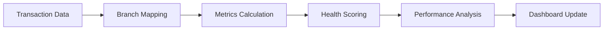
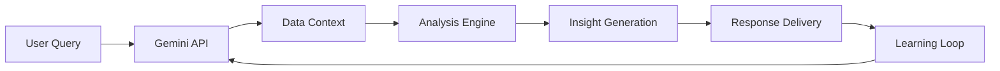

# BPI Bank Analytics Platform - Complete Documentation

## 📋 Table of Contents

1. [Project Overview](#project-overview)
2. [Quick Access](#quick-access)
3. [System Architecture](#system-architecture)
4. [Directory Structure](#directory-structure)
5. [Data Pipeline](#data-pipeline)
6. [Sentiment Analysis](#sentiment-analysis)
7. [Branch Health Scoring](#branch-health-scoring)
8. [Web Application](#web-application)
9. [Installation & Setup](#installation--setup)
10. [Usage Guide](#usage-guide)
11. [API Documentation](#api-documentation)
12. [Troubleshooting](#troubleshooting)
13. [Performance Optimization](#performance-optimization)
14. [Contributing](#contributing)

---

## 🎯 Project Overview

Branch Intelligence Platform (BIPBIP) is a comprehensive system for analyzing bank branch performance, customer sentiment, and operational metrics. The platform consists of multiple components working together to provide real-time insights into branch health and customer satisfaction.

### **Key Features**
- **Real-time Data Generation**: Simulates bank transactions with configurable parameters
- **Sentiment Analysis**: Custom ML models for analyzing customer reviews
- **Branch Health Scoring**: Multi-dimensional scoring system for branch performance
- **Interactive Dashboard**: React-based web application with real-time updates
- **Data Integration**: Google Sheets integration for data storage and sharing
- **BIP Chat (Gemini AI)**: Intelligent conversational AI for data insights and anomaly detection

### **Business Value**
- **Operational Insights**: Monitor branch performance in real-time
- **Customer Experience**: Track and analyze customer sentiment trends
- **Performance Optimization**: Identify areas for improvement
- **Decision Support**: Data-driven insights for management decisions

---

## 🏗️ System Architecture

```
┌─────────────────┐    ┌─────────────────┐    ┌─────────────────┐
│   Data Sources  │    │  Processing     │    │   Web App       │
│                 │    │  Pipeline       │    │                 │
├─────────────────┤    ├─────────────────┤    ├─────────────────┤
│ • CSV Files     │───▶│ • Data Gen      │───▶│ • React App     │
│ • Google Sheets │    │ • Sentiment     │    │ • Real-time     │
│ • APIs          │    │ • Analytics     │    │ • Dashboard     │
└─────────────────┘    └─────────────────┘    └─────────────────┘
                              │
                              ▼
                       ┌─────────────────┐
                       │   Data Storage  │
                       │                 │
                       ├─────────────────┤
                       │ • CSV Files     │
                       │ • Google Sheets │
                       │ • Local Cache   │
                       └─────────────────┘
```

### **Component Overview**

1. **Data Generation** (`bea_generator/`)
   - Simulates realistic bank transactions
   - Configurable data dispersion and quality
   - Real-time streaming capabilities

2. **Sentiment Analysis** (`sentiment_train/`)
   - Custom ML models for sentiment classification
   - Multiple algorithms (Traditional ML + BERT)
   - Performance metrics and visualizations

3. **Branch Analytics** (`overall_data/`)
   - Branch health scoring system
   - Performance metrics calculation
   - Google Sheets integration

4. **Web Application** (`bip-main/`)
   - React-based dashboard
   - Real-time data visualization
   - Interactive components
   - BIP Chat with Gemini AI integration

---

## 📁 Directory Structure

```
bipbip/
├── bea_generator/                 # Data generation system
│   ├── generate.py               # Main data generator
│   ├── test_improvements.py      # Testing script
│   ├── branch.csv               # Branch data
│   └── README_IMPROVEMENTS.md   # Generation improvements
│
├── sentiment_train/              # Sentiment analysis
│   ├── custom_sentiment_model.py # Custom ML training
│   ├── test_model.py            # Model testing
│   ├── train.py                 # Original BERT analysis
│   ├── bpi_reviews.csv          # Review dataset
│   ├── requirements.txt         # Dependencies
│   └── README_CUSTOM_MODEL.md   # Model documentation
│
├── overall_data/                 # Branch analytics
│   ├── compute.py               # Health score calculator
│   ├── manual_branch_mapping.py # Branch mapping
│   ├── analyze_branch_matching.py # Branch analysis
│   └── BRANCH_MATCHING_SOLUTION.md
│
├── bip-main/                    # Web application
│   ├── src/                     # React source code
│   │   ├── pages/              # Application pages
│   │   ├── components/         # React components
│   │   ├── context/            # React context
│   │   └── hooks/              # Custom hooks
│   ├── public/                 # Static assets
│   ├── package.json            # Dependencies
│   └── README.md               # App documentation
│
├── branch_scraper/              # Branch data collection
├── review_scraper/              # Review data collection
└── DOCUMENTATION.md             # This file
```

---

## 🔄 Data Pipeline

### **1. Data Generation Pipeline**


**Key Components:**
- **BPITransactionGenerator**: Main generation engine
- **Configurable Parameters**: Data dispersion, quality percentages
- **Real-time Streaming**: Continuous data generation
- **Multiple Output Formats**: CSV, Google Sheets

### **2. Sentiment Analysis Pipeline**


**Models Available:**
- **Traditional ML**: Logistic Regression, Random Forest, SVM, Naive Bayes
- **Deep Learning**: BERT-based models
- **Vectorizers**: TF-IDF, Count Vectorizer

### **3. Branch Analytics Pipeline**



### **4. BIP Chat (Gemini AI) Pipeline**



**Metrics Calculated:**
- Service Efficiency Score
- Customer Experience Score
- Peak Capacity Score
- Financial Performance Score
- Overall Branch Health Score (BHS)

**BIP Chat Capabilities:**
- Anomaly Detection and Alerting
- Predictive Trend Analysis
- Natural Language Data Queries
- Automated Report Generation
- Performance Insights and Recommendations
- Multi-modal Data Analysis (Text, Numbers, Charts)

---

## 🧠 Sentiment Analysis

### **Custom Model Training**

The sentiment analysis system provides comprehensive model training with detailed performance metrics.

#### **Training Process**
```bash
cd sentiment_train
pip install -r requirements.txt
python custom_sentiment_model.py
```

#### **Model Performance Metrics**
- **F1 Score**: Harmonic mean of precision and recall
- **Precision**: Accuracy of positive predictions
- **Recall**: Ability to find all positive instances
- **Accuracy**: Overall prediction accuracy
- **Confusion Matrix**: Detailed error analysis

#### **Expected Performance**
- **Traditional Models**: 0.75-0.90 F1 score
- **BERT Models**: 0.85-0.94 F1 score

#### **Model Usage**
```python
from test_model import SentimentPredictor

# Load trained model
predictor = SentimentPredictor('.', 'BERT')

# Predict sentiment
sentiment, confidence = predictor.predict("Great service today!")
print(f"Sentiment: {sentiment}, Confidence: {confidence:.3f}")
```

### **Sentiment Classification**
- **Positive**: 4-5 star ratings
- **Neutral**: 3 star ratings
- **Negative**: 1-2 star ratings

---

## 💬 **BIP Chat (Gemini AI)**

### **Overview**
BIP Chat is an intelligent conversational AI powered by Google's Gemini API that provides comprehensive data analysis, insights, and predictive capabilities for the Branch Intelligence Platform.

### **Core Capabilities**

#### **1. Intelligent Data Analysis**
- **Contextual Understanding**: Learns from all branch data sources
- **Multi-Modal Processing**: Analyzes text, numerical data, charts, and visualizations
- **Real-time Insights**: Provides instant analysis of current performance metrics
- **Historical Context**: Incorporates historical data for trend analysis

#### **2. Anomaly Detection**
- **Pattern Recognition**: Identifies unusual performance patterns
- **Threshold Monitoring**: Alerts on performance deviations
- **Predictive Alerts**: Forecasts potential issues before they occur
- **Root Cause Analysis**: Suggests possible causes for anomalies

#### **3. Natural Language Interface**
- **Plain English Queries**: Ask questions about branch performance naturally
- **Conversational Responses**: Human-like interaction with detailed explanations
- **Multi-language Support**: Handles Filipino and English queries
- **Contextual Memory**: Remembers conversation context for follow-up questions

#### **4. Predictive Analytics**
- **Trend Forecasting**: Predicts future performance based on historical data
- **Scenario Planning**: Models "what-if" scenarios for decision making
- **Risk Assessment**: Evaluates potential risks and their impact
- **Opportunity Identification**: Highlights improvement opportunities

#### **5. Automated Reporting**
- **Executive Summaries**: Generates comprehensive performance summaries
- **Custom Reports**: Creates tailored reports based on user requirements
- **Visual Insights**: Produces charts and visualizations for data presentation
- **Actionable Recommendations**: Provides specific improvement suggestions

### **Integration with Platform Data**

#### **Data Sources**
- **Transaction Data**: Real-time BEA kiosk information
- **Sentiment Analysis**: Customer review and feedback data
- **Performance Metrics**: Branch health scores and KPIs
- **Historical Trends**: Long-term performance patterns
- **Geographic Data**: Location-based insights and comparisons

#### **Learning Capabilities**
- **Continuous Improvement**: Learns from user interactions and feedback
- **Pattern Recognition**: Identifies recurring issues and solutions
- **User Preference Learning**: Adapts to individual user needs
- **Knowledge Base Expansion**: Builds comprehensive understanding over time

### **Use Cases**

#### **1. Branch Managers**
- **Daily Performance Review**: "How did my branch perform today?"
- **Anomaly Investigation**: "Why is the wait time higher than usual?"
- **Staffing Optimization**: "What's the optimal staff level for tomorrow?"
- **Customer Satisfaction**: "What are the main complaints this week?"

#### **2. Regional Directors**
- **Network Overview**: "Which branches need immediate attention?"
- **Trend Analysis**: "What's the performance trend across my region?"
- **Resource Allocation**: "Where should I allocate additional resources?"
- **Competitive Analysis**: "How do we compare to industry benchmarks?"

#### **3. Operations Teams**
- **System Monitoring**: "Are there any system-wide issues?"
- **Capacity Planning**: "What's the peak capacity utilization?"
- **Process Optimization**: "Which processes can be improved?"
- **Risk Management**: "What are the top risks this month?"

### **Technical Implementation**

#### **API Integration**
```python
# Gemini API Integration Example
from google.generativeai import GenerativeModel

class BIPChatService:
    def __init__(self, api_key):
        self.model = GenerativeModel('gemini-pro')
        self.context = self.load_branch_data()
    
    def analyze_query(self, user_query):
        # Combine user query with contextual data
        enhanced_prompt = self.create_contextual_prompt(user_query)
        response = self.model.generate_content(enhanced_prompt)
        return self.process_response(response)
```

#### **Data Context Management**
- **Real-time Data Integration**: Connects to live branch data feeds
- **Historical Data Access**: Incorporates comprehensive historical records
- **Multi-source Aggregation**: Combines data from various platforms
- **Contextual Enhancement**: Enriches queries with relevant background information

#### **Response Generation**
- **Structured Output**: Provides organized, actionable insights
- **Visual Elements**: Includes charts and visualizations when appropriate
- **Confidence Scoring**: Indicates reliability of predictions and insights
- **Source Attribution**: References data sources for transparency

---

## 📊 Branch Health Scoring

### **Scoring Components**

The Branch Health Score (BHS) is calculated using a weighted formula:

```
BHS = (Service Efficiency × 0.4) + 
      (Customer Experience × 0.3) + 
      (Peak Capacity × 0.2) + 
      (Financial Performance × 0.1)
```

#### **1. Service Efficiency Score (40%)**
- **Waiting Time**: Average customer wait time
- **Processing Time**: Average transaction processing time
- **Total Transaction Time**: Combined service time
- **Transaction Type Efficiency**: Handling of complex transactions

#### **2. Customer Experience Score (30%)**
- **Sentiment Analysis**: Average customer sentiment
- **Consistency**: Sentiment variance analysis
- **Volume Consideration**: Quality maintenance at high volume

#### **3. Peak Capacity Score (20%)**
- **Daily Volume Management**: Handling peak vs normal days
- **Capacity Utilization**: Efficient resource allocation
- **Performance Consistency**: Stable performance across days

#### **4. Financial Performance Score (10%)**
- **Branch-specific Metrics**: Randomized but consistent scores
- **Performance Distribution**: Realistic variation across branches

### **Performance Standards**

#### **Service Standards (Minutes)**
| Transaction Type | Normal Waiting | Peak Waiting | Normal Processing | Peak Processing |
|------------------|----------------|--------------|-------------------|-----------------|
| Withdrawal       | 2.5           | 6.0          | 2.5               | 3.5             |
| Deposit          | 3.0           | 8.0          | 3.0               | 4.5             |
| Encashment       | 4.0           | 10.0         | 4.0               | 6.0             |
| Transfer         | 3.0           | 6.0          | 3.0               | 4.0             |
| Customer Service | 5.0           | 12.0         | 7.0               | 12.0            |
| Account Service  | 8.0           | 15.0         | 10.0              | 15.0            |
| Loan             | 10.0          | 20.0         | 15.0              | 25.0            |

#### **Capacity Standards**
- **Normal Day**: 150 customers
- **Peak Day**: 270 customers
- **BEA Count**: 3-4 per branch

---

## 🌐 Web Application

### **Technology Stack**
- **Frontend**: React 18 with Vite
- **Styling**: CSS3 with custom components
- **State Management**: React Context API
- **Data Visualization**: Custom charts and components
- **Real-time Updates**: WebSocket-like polling

### **Backend & AI Services**
- **Language**: Python 3.8+
- **Data Processing**: Pandas, NumPy
- **ML Framework**: Scikit-learn, Transformers
- **Deep Learning**: PyTorch, BERT
- **API Integration**: Google Sheets API, Gemini API
- **Conversational AI**: Google Gemini Pro for BIP Chat

### **Application Structure**

#### **Pages**
1. **Dashboard** (`/`)
   - Real-time KPIs
   - Performance charts
   - Branch health overview
   - AI insights

2. **Branches** (`/branches`)
   - Branch listing
   - Interactive map
   - Performance details
   - Filtering and search

3. **Reports** (`/reports`)
   - Sentiment analysis reports
   - Performance trends
   - Customer satisfaction metrics

4. **Logs** (`/logs`)
   - Transaction logs
   - System events
   - Error tracking

5. **Simulation** (`/simulation`)
   - Branch floor plans
   - Performance simulation
   - What-if analysis

6. **Help** (`/help`)
   - User documentation
   - System guides
   - FAQ

#### **Key Components**

##### **Dashboard Components**
- `KPICards`: Real-time performance indicators
- `TransactionChart`: Transaction volume visualization
- `BranchPerformance`: Branch comparison charts
- `CustomerSatisfaction`: Sentiment analysis display
- `AIInsights`: AI-powered recommendations

##### **Interactive Features**
- `BIP Chat`: Gemini AI-powered conversational interface
- `FloatingAIChat`: AI assistant for queries
- `BranchMap`: Interactive branch location map
- `SimulationControls`: Performance simulation tools

### **Real-time Features**
- **Live Updates**: Automatic data refresh every 30 seconds
- **WebSocket-like**: Polling-based real-time updates
- **Performance Monitoring**: Real-time branch health tracking
- **Alert System**: Performance threshold notifications

---

## 🛠️ Installation & Setup

### **Prerequisites**
- Python 3.8+
- Node.js 16+
- Google Cloud Platform account (for Sheets API)
- Git

### **1. Clone Repository**
```bash
git clone <repository-url>
cd bipbip
```

### **2. Data Generation Setup**
```bash
cd bea_generator
pip install pandas numpy matplotlib seaborn gspread google-auth
```

### **3. Sentiment Analysis Setup**
```bash
cd sentiment_train
pip install -r requirements.txt
```

### **4. Branch Analytics Setup**
```bash
cd overall_data
pip install pandas gspread google-auth scikit-learn
```

### **5. Web Application Setup**
```bash
cd bip-main
npm install
```

### **6. Google Sheets Configuration**
1. Create a Google Cloud Project
2. Enable Google Sheets API
3. Create service account credentials
4. Download JSON credentials file
5. Place in appropriate directories

### **7. Environment Configuration**
Create `.env` files in respective directories:

```bash
# bea_generator/.env
GOOGLE_SHEETS_ID=your_sheet_id
CREDENTIALS_PATH=path_to_credentials.json

# overall_data/.env
GOOGLE_SHEETS_ID=your_sheet_id
CREDENTIALS_PATH=path_to_credentials.json
```

---

## 🚀 Usage Guide

### **1. Data Generation**

#### **Basic Generation**
```bash
cd bea_generator
python generate.py
```

#### **Configuration Options**
- **Data Dispersion**: 0.5-2.0 (controls data spread)
- **Quality Percentage**: 50-90% (good vs bad data ratio)
- **Generation Mode**: Range, Real-time, Today only

#### **Real-time Streaming**
```bash
python generate.py
# Select option 2: Real-time streaming
# Configure frequency and batch size
```

### **2. Sentiment Analysis**

#### **Train Custom Model**
```bash
cd sentiment_train
python custom_sentiment_model.py
```

#### **Test Model**
```bash
python test_model.py
```

#### **Expected Output**
- Model performance metrics
- F1 scores and confusion matrices
- Visualization charts
- Saved model files

### **3. Branch Analytics**

#### **Run Health Score Calculator**
```bash
cd overall_data
python compute.py
```

#### **Options**
- **Single Update**: One-time calculation
- **Continuous Monitoring**: Real-time updates

#### **Branch Mapping**
The system automatically maps branches between different data sources using:
- Exact name matching
- Similarity scoring
- Manual mappings for difficult cases

### **4. Web Application**

#### **Development Mode**
```bash
cd bip-main
npm run dev
```

#### **Production Build**
```bash
npm run build
npm run preview
```

#### **Access Application**
- **Development**: http://localhost:5173
- **Production**: Configure your hosting service

### **5. BIP Chat (Gemini AI)**

#### **Configuration**
```bash
# Set up Gemini API credentials
export GEMINI_API_KEY="your_gemini_api_key"

# Configure BIP Chat service
python -c "from bip_chat import BIPChatService; service = BIPChatService()"
```

#### **Usage Examples**
```python
# Initialize BIP Chat
chat_service = BIPChatService(api_key="your_key")

# Ask questions about branch performance
response = chat_service.analyze_query("How did Makati branch perform today?")

# Detect anomalies
anomalies = chat_service.detect_anomalies(branch_data)

# Generate insights
insights = chat_service.generate_insights(performance_metrics)
```

---

## 📡 API Documentation

### **Data Generation API**

#### **BPITransactionGenerator Class**
```python
class BPITransactionGenerator:
    def __init__(self, sheet_id, credentials_path, 
                 data_dispersion=1.0, good_data_percentage=70.0)
    
    def generate_date_range_data(self, start_date, end_date)
    def generate_realtime_data(self, start_date, days, frequency)
    def save_to_csv(self, df, filename)
    def upload_to_sheets(self, df)
```

#### **Configuration Parameters**
- `data_dispersion`: Controls data spread (0.5-2.0)
- `good_data_percentage`: Quality control (50-90%)
- `frequency`: Real-time update frequency
- `records_per_interval`: Batch size for streaming

### **Sentiment Analysis API**

#### **CustomSentimentModel Class**
```python
class CustomSentimentModel:
    def __init__(self, csv_path)
    
    def load_and_preprocess_data(self)
    def train_traditional_models(self)
    def train_bert_model(self)
    def generate_detailed_report(self)
    def save_model(self)
```

#### **SentimentPredictor Class**
```python
class SentimentPredictor:
    def __init__(self, model_path, model_type)
    
    def predict(self, text)
    def predict_batch(self, texts)
    def load_model(self, model_path, model_type)
```

### **Branch Analytics API**

#### **BPIBranchHealthCalculator Class**
```python
class BPIBranchHealthCalculator:
    def __init__(self, sheet_id, credentials_path)
    
    def process_and_update(self)
    def run_continuous_monitoring(self, update_interval_seconds)
    def run_single_update(self)
    def calculate_branch_health_score(self, service_eff, customer_exp, 
                                    peak_capacity, financial_perf)
```

### **BIP Chat (Gemini AI) API**

#### **BIPChatService Class**
```python
class BIPChatService:
    def __init__(self, gemini_api_key, branch_data_context)
    
    def analyze_query(self, user_query)
    def detect_anomalies(self, performance_data)
    def generate_insights(self, data_context)
    def create_report(self, report_type, parameters)
    def predict_trends(self, historical_data, forecast_period)
    def learn_from_interaction(self, query, response, feedback)
```

---

## 🔧 Troubleshooting

### **Common Issues**

#### **1. Data Generation Issues**

**Problem**: Google Sheets connection error
```bash
# Solution: Check credentials
1. Verify credentials file path
2. Ensure Google Sheets API is enabled
3. Check sheet permissions
```

**Problem**: Memory error with large datasets
```bash
# Solution: Reduce batch size
python generate.py
# Select smaller batch sizes
# Use data dispersion < 1.0
```

#### **2. Sentiment Analysis Issues**

**Problem**: Model training fails
```bash
# Solution: Check dependencies
pip install -r requirements.txt
python -c "import torch, transformers, sklearn"
```

**Problem**: Poor model performance
```bash
# Solution: Improve data quality
1. Check review data quality
2. Increase training data size
3. Try different model parameters
4. Use BERT model for better performance
```

#### **3. Branch Analytics Issues**

**Problem**: Branch mapping failures
```bash
# Solution: Check branch names
1. Review manual_branch_mapping.py
2. Add missing branches to branch.csv
3. Check naming conventions
```

**Problem**: Performance calculation errors
```bash
# Solution: Verify data format
1. Check CSV column names
2. Ensure numeric data types
3. Handle missing values
```

#### **4. Web Application Issues**

**Problem**: Build errors
```bash
# Solution: Check dependencies
npm install
npm audit fix
```

**Problem**: Real-time updates not working
```bash
# Solution: Check data pipeline
1. Verify data generation is running
2. Check Google Sheets connection
3. Review update intervals
```

### **Performance Optimization**

#### **1. Data Generation**
- Use appropriate batch sizes
- Configure data dispersion based on needs
- Optimize Google Sheets API calls

#### **2. Sentiment Analysis**
- Use GPU for BERT training
- Implement model caching
- Optimize text preprocessing

#### **3. Branch Analytics**
- Implement data caching
- Optimize calculation algorithms
- Use efficient data structures

#### **4. Web Application**
- Implement lazy loading
- Optimize bundle size
- Use efficient state management

---

## 📈 Performance Optimization

### **System Performance**

#### **Data Generation Optimization**
```python
# Optimize for large datasets
generator = BPITransactionGenerator(
    sheet_id=SHEET_ID,
    data_dispersion=0.8,  # Tighter data
    good_data_percentage=75  # Balanced quality
)
```

#### **Sentiment Analysis Optimization**
```python
# Use efficient models for production
models = {
    'Logistic Regression': LogisticRegression(max_iter=500),
    'Multinomial NB': MultinomialNB(),  # Fastest
}
```

#### **Branch Analytics Optimization**
```python
# Optimize calculation frequency
calculator.run_continuous_monitoring(update_interval_seconds=60)  # 1 minute
```

### **Web Application Optimization**

#### **Bundle Optimization**
```bash
# Analyze bundle size
npm run build
npm run analyze
```

#### **Performance Monitoring**
```javascript
// Monitor real-time performance
const performanceObserver = new PerformanceObserver((list) => {
  for (const entry of list.getEntries()) {
    console.log('Performance:', entry.name, entry.duration);
  }
});
performanceObserver.observe({ entryTypes: ['measure'] });
```

---

## 🤝 Contributing

### **Development Guidelines**

#### **Code Style**
- Follow PEP 8 for Python code
- Use ESLint for JavaScript/React code
- Write comprehensive docstrings
- Include type hints for Python functions

#### **Testing**
```bash
# Python testing
python -m pytest tests/

# React testing
npm test
```

#### **Documentation**
- Update this documentation for new features
- Include code examples
- Document API changes
- Maintain README files

### **Feature Development**

#### **Adding New Models**
1. Implement model class
2. Add to training pipeline
3. Update performance comparison
4. Document model parameters

#### **Adding New Metrics**
1. Implement calculation function
2. Add to scoring system
3. Update dashboard components
4. Document metric meaning

#### **Adding New Visualizations**
1. Create React component
2. Implement data processing
3. Add to dashboard
4. Document usage

---

## 📞 Support & Maintenance

### **Regular Maintenance**

#### **Data Pipeline**
- Monitor data generation logs
- Check Google Sheets API quotas
- Verify data quality metrics
- Update branch mappings

#### **Model Performance**
- Retrain models periodically
- Monitor performance degradation
- Update training data
- Validate predictions

#### **System Health**
- Monitor application performance
- Check error logs
- Update dependencies
- Backup critical data

### **Support Channels**
- **Documentation**: This file and README files
- **Code Comments**: Inline documentation
- **Error Logs**: System-generated logs
- **Performance Metrics**: Built-in monitoring

---

## 📄 License & Legal

### **Data Privacy**
- All data is simulated for demonstration
- No real customer data is used
- Follow data protection regulations
- Implement proper access controls

### **Usage Terms**
- For educational and demonstration purposes
- Not for production banking systems
- Follow security best practices
- Respect API rate limits

---

## 🎯 Future Enhancements

### **Planned Features**
1. **Advanced Analytics**: Machine learning for predictive insights
2. **Mobile Application**: React Native mobile app
3. **Real-time Alerts**: Automated notification system
4. **Advanced Visualizations**: 3D charts and interactive maps
5. **API Gateway**: RESTful API for external integrations
6. **Multi-language Support**: Internationalization
7. **Advanced Security**: Role-based access control
8. **Cloud Deployment**: AWS/Azure deployment options
9. **Enhanced BIP Chat**: Advanced conversational AI with voice interface
10. **AI-Powered Recommendations**: Automated action suggestions based on insights

### **Technology Upgrades**
1. **Next.js Migration**: Server-side rendering
2. **GraphQL API**: Efficient data fetching
3. **Microservices**: Scalable architecture
4. **Containerization**: Docker deployment
5. **CI/CD Pipeline**: Automated deployment

---

**Last Updated**: August 2025
**Version**: 1.1.0  
**Maintainer**: tenshin

---

*This documentation provides a comprehensive guide to the Branch Intelligence Platform. For specific questions or issues, refer to the individual component documentation or contact the development team.*
